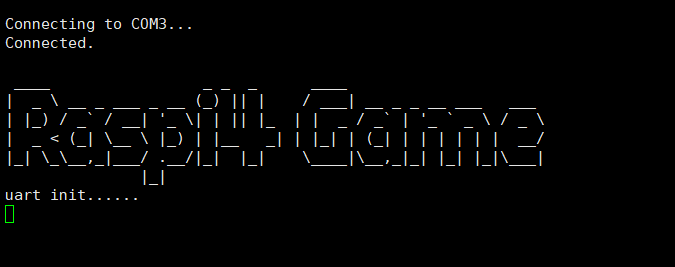
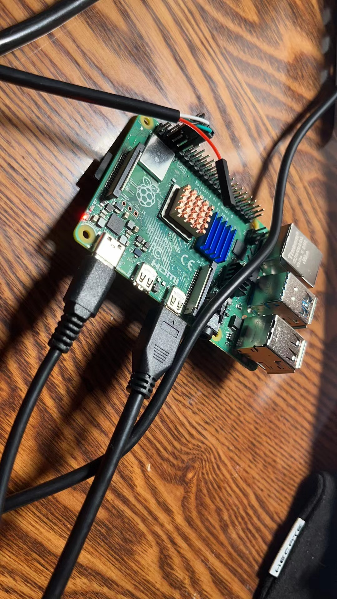

# Raspi4 Game

## Introduction

I will write a bare metal game in the new raspberry pi 4 during learning for postgraduate exam. I hope to use most of peripherals in the raspberry pi.

## Tools:
- Rasberrypi4 Board
- Dev Machine
- A USB to TTL Cable
- Jlink to debug

## References:

- [rpi4-osdev](https://github.com/isometimes/rpi4-osdev)
- [BCM2711 Peripherals](https://datasheets.raspberrypi.com/bcm2711/bcm2711-peripherals.pdf)
- [使用jtag和gdb实时调试Linux内核](https://zhuanlan.zhihu.com/p/484675324)
- [Debugging Raspberry Pi 3 with JTAG](https://www.suse.com/c/debugging-raspberry-pi-3-with-jtag/)
- [OpenOCD 通过 JTAG 调试树莓派](https://blog.csdn.net/lyndon_li/article/details/124083860)